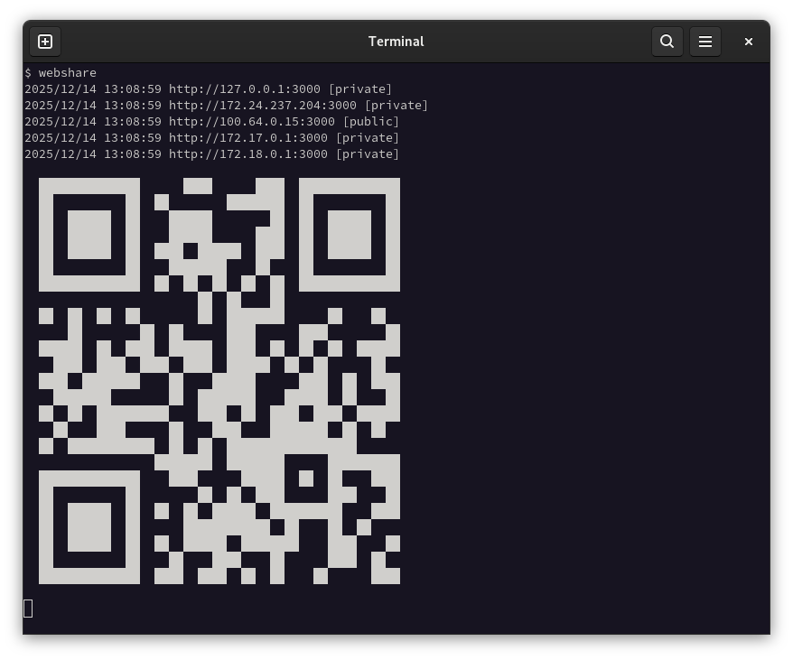

# miscutils

> Hyperecclectic mix of cli tools.

## webshare

Instantly share a directory over the web, with QR code support.

```
$ webshare -d . -p 8080
```



## fixfn

```
$ fixfn -d "REPORT FINAL 2.pptx"
renaming: 'REPORT FINAL 2.pptx' to 'report_final_2.pptx'
```

## bytehist

```
$ ./bytehist bytehist
total bytes: 1978530   distinct values: 256   showing: 15

0x00 \x00 473910  23.95%  ████████████████████████████████████████
0x48 H     80227   4.05%  ██████
0x01 \x01  65234   3.30%  █████
0xff \xff  62394   3.15%  █████
0x02 \x02  56005   2.83%  ████
0x24 $     40571   2.05%  ███
0xcc \xcc  38834   1.96%  ███
0x89 \x89  32524   1.64%  ██
0x8b \x8b  31699   1.60%  ██
0x04 \x04  29886   1.51%  ██
0x0f \x0f  29129   1.47%  ██
0x08 \x08  27182   1.37%  ██
0x03 \x03  24757   1.25%  ██
0x05 \x05  23574   1.19%  █
0x74 t     21276   1.08%  █
```
